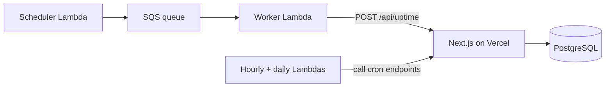

# Sentinel

A multi-region uptime monitor. Lambdas in three AWS regions ping your websites every 2 minutes, store every ping, roll them up hourly for the dashboard, and email you when a site goes down.

## Features

- Checks from **ap-south-1, us-east-1 and eu-west-1** every 2 minutes
- Latency charts per region: raw pings for the last hour, hourly **P50 / P95 / P99 / Avg** for 24 hours
- Uptime for 24h / 7d / 30d and a daily uptime bar
- Incidents (**Regional** or **Global**) with email alerts when they open and resolve
- Google sign-in (Better Auth), alert emails through Resend

## Tech stack

Next.js, TypeScript, Prisma, PostgreSQL, AWS Lambda, SQS, EventBridge, AWS CDK, Turborepo, Bun, Vercel, Recharts.

## How it works



1. **Check.** Every 2 minutes the scheduler in each region queues the list of sites. The worker pings them and sends the results to `/api/uptime`, which saves one `WebsiteTick` per site and region. A timeout or network error is saved as `status = 0`.
2. **Summarize.** Every hour a Lambda calls `/api/compile`. It turns the previous hour of ticks into `WebsiteMetric` rows: one per region, plus an `ALL` row for the whole site. The dashboard reads these rows instead of scanning raw pings.
3. **Alert.** After each batch the app checks the last 2 rounds. 2 bad rounds in a row open an incident (1 region down is Regional, 2 or more is Global), and 2 good rounds close it. Each change sends an email.
4. **Clean up.** Raw ticks are deleted after 2 days. The hourly rows are kept.

**Calculation rules**
- A failure is `status = 0` or `status >= 400`.
- Latency stats (avg, P50, P95, P99) only use successful responses. Failures show up in uptime instead.
- `ALL` is calculated from the raw pings.
- Hours are UTC. Re-running an hour just updates its rows.

## Data model

| Table | Purpose |
|---|---|
| `Website` | Monitored sites and their current status |
| `Region` | One row per AWS region. `name` must equal the Lambda's `AWS_REGION` |
| `WebsiteTick` | One raw ping per site, region and round |
| `WebsiteMetric` | Hourly rollup per site and region, plus an `ALL` row |
| `Incident` | Regional or Global outages. `cause` holds the down regions, joined by `, ` |

## Local setup

```bash
bun install
# set the env vars below
bunx prisma generate        # run in the db package
bun run dev
```

1. Add three rows to the `Region` table: `ap-south-1`, `us-east-1`, `eu-west-1`.
2. Create the "one open incident per site" index by hand. Prisma 6 has no way to write a partial index in the schema, so it create manually:

```sql
CREATE UNIQUE INDEX one_open_incident_per_site
  ON "Incident" ("websiteId") WHERE "endedAt" IS NULL;
```

Without it, the three regions can open duplicate incidents at the same moment.

## Environment variables

**Web app (Vercel)**

| Variable | Notes |
|---|---|
| `DATABASE_URL` | PostgreSQL connection string |
| `BETTER_AUTH_SECRET` | Auth secret |
| `GOOGLE_CLIENT_ID`, `GOOGLE_CLIENT_SECRET` | Google OAuth |
| `NEXT_PUBLIC_APP_URL` | Your domain. Baked in at build time, so redeploy after changing it |
| `INTERNAL_API_KEY` | Shared secret for Lambda calls (`x-api-key` header) |
| `RESEND_API_KEY` | Alert emails |

**Lambdas (set in your shell when you run the CDK deploy)**

| Variable | Notes |
|---|---|
| `BACKEND_URL` | Base URL of the deployed web app |
| `INTERNAL_API_KEY` | Must match the web app |

Lambda env vars are baked in at deploy time, so changing `.env` does nothing until you redeploy.

## Deploy

- **Web:** push to Vercel. The build runs `prisma generate` through Turborepo.
- **Lambdas:** run `bun run deploy` in the CDK package. The scheduler and worker run in all three regions. The hourly and daily Lambdas run only in `ap-south-1`.

`bun run destroy` removes everything.

## Where things live

| Path | What |
|---|---|
| `lambdas/scheduler.ts`, `worker.ts` | Queue the sites, ping them |
| `lambdas/compiler.ts`, `cleanup.ts` | Hourly and daily triggers |
| `app/api/uptime/route.ts` | Receives ticks from the workers |
| `app/api/compile`, `app/api/cleanup` | Cron endpoints (API key required) |
| `lib/cron/hourlyCompiler.ts` | Hourly rollup SQL |
| `lib/checkIncident.ts` | Incident detection and alert emails |
| `lib/getMonitorData.ts` | Builds the data for the monitor page |